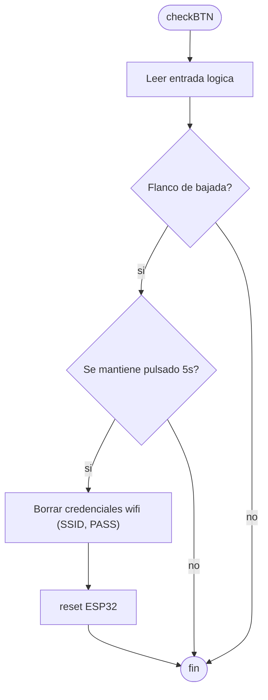

```mermaid
flowchart TB
    A(["checkBTN"]) --> n1["Leer entrada logica"]
    n1 --> n2{"Flanco de bajada?"}
    n2 -- si --> n3{"Se mantiene pulsado 5s?"}
    n3 -- si --> n4["Borrar credenciales wifi (SSID, PASS)"]
    n4 --> n5["reset ESP32"]
    n5 --> n6(["fin"])
    n2 -- no --> n6
    n3 -- no --> n6
```
